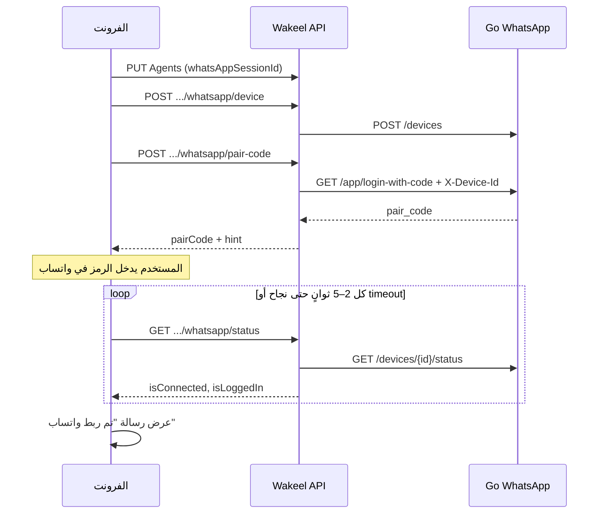

# توثيق ربط واتساب (Pair Code) للفرونت — Wakeel + go-whatsapp-web-multidevice

يستبدل هذا التدفق **ربط الجلسة القديم (QR عبر wwebjs)**. كل الاستدعاءات من الفرونت تمر عبر **Wakeel API** مع **JWT**؛ لا يحتاج الفرونت معرفة عنوان خادم Go مباشرة (يُضبط في `GoWhatsApp` على السيرفر فقط).

---

## 1) المفاهيم

| المصطلح | المعنى |
|---------|--------|
| **`agentId`** | معرف الوكيل (GUID) في Wakeel — يظهر في `GET /api/Agents` أو من بيانات المستخدم. |
| **`WhatsAppSessionId`** | حقل الوكيل في قاعدة البيانات؛ يجب أن يطابق **`device_id`** في خادم Go. نفس القيمة تُرسل في ترويسة `X-Device-Id` عند الإرسال. يُفضّل معرّف فريد ثابت (مثلاً رقم الوكيل بدون أصفار زائدة: `7722052527`). |
| **Pair Code** | رمز يظهر للمستخدم؛ يُدخله في واتساب الهاتف تحت «ربط بالرقم بدلاً من QR». |
| **`isConnected` / `isLoggedIn`** | من خادم Go: الاتصال بخوادم واتساب مقابل إتمام تسجيل الدخول للجلسة. للإرسال يهم **`isLoggedIn === true`**. |

---

## 2) المتطلبات قبل البدء

1. **توكن JWT** صالح: `Authorization: Bearer <access_token>` على كل الطلبات.
2. للوكيل: **`whatsAppSessionId`** غير فارغ قبل `device` و`pair-code` (يُحدَّث عبر `PUT /api/Agents/{id}` أو عند الإنشاء إن وُجد في الـ DTO).
3. خادم **go-whatsapp-web-multidevice** يعمل و**Wakeel** مضبوط بقسم `GoWhatsApp` (`BaseUrl`, `BasicAuth` إن لزم).

---

## 3) تدفق الربط (للفرونت) — خطوة بخطوة



### الخطوة أ — تعيين معرف الجهاز (إن لم يكن معبأً)

**مسار:** `PUT /api/Agents/{agentId}`

**الجسم (مثال):** نفس حقول التحديث المعتادة مع:

```json
{
  "fullName": "...",
  "companyName": "...",
  "phone": "07712345678",
  "whatsAppSessionId": "7722052527",
  ...
}
```

> **`whatsAppSessionId`** يجب أن يبقى ثابتاً لهذا الوكيل بعد الربط الناجح (تغييره يعني جهازاً جديداً في Go).

---

### الخطوة ب — تسجيل الجهاز في Go (عبر Wakeel)

**مسار:** `POST /api/Agents/{agentId}/whatsapp/device`

**هيدر:** `Authorization: Bearer <token>`  
**جسم:** لا يوجد (أو فارغ).

**نجاح `200`:**

```json
{
  "message": "تم تسجيل الجهاز. يمكنك طلب رمز الاقتران (pair code) لاحقاً.",
  "deviceId": "7722052527"
}
```

**أخطاء شائعة:**

| HTTP | المعنى |
|------|--------|
| `400` | `{ "message": "عيّن أولاً WhatsAppSessionId للوكيل..." }` |
| `403` | وكيل يحاول ربط وكيل آخر. |
| `404` | الوكيل غير موجود. |
| `502` | `{ "message": "..." }` — خادم Go غير متاح أو رفض الطلب. |

**ما يفعله Wakeel داخلياً مع Go:**  
`POST {GoWhatsApp:BaseUrl}{AppBasePath}/devices`  
جسم JSON: `{ "device_id": "<WhatsAppSessionId>" }`  
+ Basic Auth إن وُجد في الإعدادات.

---

### الخطوة ج — طلب رمز الاقتران وإرجاعه للفرونت

**مسار:** `POST /api/Agents/{agentId}/whatsapp/pair-code`  
**استعلام اختياري:** `?phone=9647712345678`  
- إن **لم** تُرسل `phone` يُستخدم **`Agent.Phone`** من قاعدة Wakeel.  
- الرقم يُنظَّف إلى أرقام؛ صيغة Go للتحقق: حتى 15 رقماً (مع كود الدولة).

**نجاح `200` — ما يعرضه الفرونت:**

```json
{
  "pairCode": "XXXX-XXXX",
  "deviceId": "7722052527",
  "hint": "في واتساب: الإعدادات ← الأجهزة المرتبطة ← ربط جهاز ← ربط بالرقم بدلاً من رمز QR."
}
```

**واجهة المستخدم المقترحة:**

1. عرض **`pairCode`** بخط واضح مع زر نسخ.
2. عرض **`hint`** أو نص ثابت مختصر بنفس المعنى.
3. رابط مساعد (اختياري): صفحة مساعدة واتساب الرسمية لربط الجهاز.

**أخطاء شائعة:**

| HTTP | مثال |
|------|--------|
| `400` | لا يوجد `phone` ولا رقم في سجل الوكيل. |
| `400` | `WhatsAppSessionId` فارغ أو لم يُستدعَ `device` بعد. |
| `502` | فشل الاتصال بـ Go أو رفض طلب الاقتران. |

**ما يفعله Wakeel داخلياً مع Go:**  
`GET {Base}/app/login-with-code?phone=<أرقام>`  
ترويسة: `X-Device-Id: <WhatsAppSessionId>`  
+ Basic Auth إن وُجد.

---

### الخطوة د — التحقق من الجلسة (متصلة؟ مسجّل دخول؟)

**مسار:** `GET /api/Agents/{agentId}/whatsapp/status`

**نجاح `200`:**

```json
{
  "deviceId": "7722052527",
  "isConnected": true,
  "isLoggedIn": true
}
```

| الحقل | تفسير للفرونت |
|--------|----------------|
| `isConnected` | عميل Go متصل بخوادم واتساب. |
| `isLoggedIn` | الجلسة جاهزة لإرسال الرسائل عبر Wakeel. **اعرض «واتساب مربوط» عندما `isLoggedIn === true`**. |

**اقتراح الفرونت بعد طلب `pair-code`:**

- استدعاء **`GET .../whatsapp/status`** كل **2–5 ثوانٍ** لمدة **1–2 دقيقة** (أو حتى `isLoggedIn === true`).
- عند **`isLoggedIn === true`**: أوقف الاستطلاع، واعرض رسالة نجاح، مثلاً:  
  **«تم ربط واتساب بنجاح. يمكنك إرسال رسائل التفعيل والتنبيه للمشتركين.»**
- إن انتهى الوقت وما زال `isLoggedIn === false`: اعرض تنبيهاً بإعادة المحاولة أو التحقق من إدخال الرمز على الهاتف.

**أخطاء:**

| HTTP | المعنى |
|------|--------|
| `400` | `WhatsAppSessionId` غير معرّف. |
| `502` | تعذّر قراءة الحالة من Go. |

**ما يفعله Wakeel داخلياً:**  
`GET {Base}/devices/{deviceId}/status` (مع ترميز `deviceId` في المسار إن لزم).

---

## 4) الصلاحيات (من يستطيع ماذا؟)

- **Admin:** أي `agentId`.
- **Agent / SubAgent:** فقط **`agentId`** الخاص بهم (وكالة المستخدم الحالي).
- **MainAgent:** فقط الوكلاء التابعون له (`CreatedByMainAgentUserId`).

عند المخالفة: **`403 Forbidden`** (بدون جسم موحّد دائماً).

---

## 5) أمثلة `curl` (للاختبار)

استبدل `BASE` و`TOKEN` و`AGENT_ID`:

```bash
# 1) تسجيل الجهاز
curl -sS -X POST "$BASE/api/Agents/AGENT_ID/whatsapp/device" \
  -H "Authorization: Bearer TOKEN"

# 2) طلب Pair Code (رقم من سجل الوكيل)
curl -sS -X POST "$BASE/api/Agents/AGENT_ID/whatsapp/pair-code" \
  -H "Authorization: Bearer TOKEN"

# أو تمرير رقم صريح
curl -sS -X POST "$BASE/api/Agents/AGENT_ID/whatsapp/pair-code?phone=9647712345678" \
  -H "Authorization: Bearer TOKEN"

# 3) حالة الجلسة
curl -sS "$BASE/api/Agents/AGENT_ID/whatsapp/status" \
  -H "Authorization: Bearer TOKEN"
```

---

## 6) ما يتوقف عن استخدامه في الفرونت (الربط القديم)

- فتح نوافذ أو iframes لـ **wwebjs** مثل `/session/start/...` أو مسح **QR** من خادم Node.
- أي **`x-api-key`** أو عنوان **whapi** مخصّص لربط الجلسة من المتصفح (الإرسال أصبح من Wakeel → Go).

**الإرسال للمشتركين** (تفعيل / تنبيه / تفاصيل) يبقى كما هو إن كنتم تستدعون بالفعل:

- `POST /api/subscribers/{subscriberId}/send-whatsapp-activation`
- وما شابه — **لا تغيير في المسار**؛ الشرط أن `isLoggedIn` يكون true للوكيل.

---

## 7) ملخص مسارات Wakeel (لجدول تكامل الفرونت)

| الطريقة | المسار | الغرض |
|---------|--------|--------|
| `POST` | `/api/Agents/{agentId}/whatsapp/device` | تسجيل `device_id` في Go |
| `POST` | `/api/Agents/{agentId}/whatsapp/pair-code` | إرجاع `pairCode` للواجهة |
| `GET` | `/api/Agents/{agentId}/whatsapp/status` | `isConnected` / `isLoggedIn` |
| `PUT` | `/api/Agents/{agentId}` | تعيين `whatsAppSessionId` (قبل device) |

---

## 8) مسارات Go التي يستدعيها Wakeel (مرجع للمطوّرين — لا تستدعها من الفرونت مباشرة)

| Go (نسبي لـ `BaseUrl` + `AppBasePath`) | الاستخدام |
|----------------------------------------|-----------|
| `POST /devices` | إنشاء/تسجيل جهاز |
| `GET /app/login-with-code?phone=...` + `X-Device-Id` | الحصول على Pair Code |
| `GET /devices/{device_id}/status` | حالة الاتصال والجلسة |

---

## 9) إعدادات Wakeel ذات الصلة (`appsettings` / متغيرات البيئة)

- `GoWhatsApp:BaseUrl` — عنوان خادم Go.
- `GoWhatsApp:AppBasePath` — إن كان API تحت بادئة (مثل `/whapi`).
- `GoWhatsApp:BasicAuthUser` / `BasicAuthPassword` — إن فعّلتم Basic Auth على Go.

---

بهذا التوثيق يمكن للفرونت استبدال تدفق QR بالكامل بتدفق: **تحديث الوكيل → device → pair-code → عرض الرمز → استطلاع status → رسالة نجاح عند `isLoggedIn`**.
